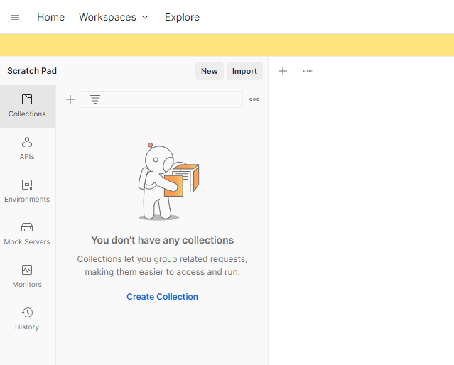
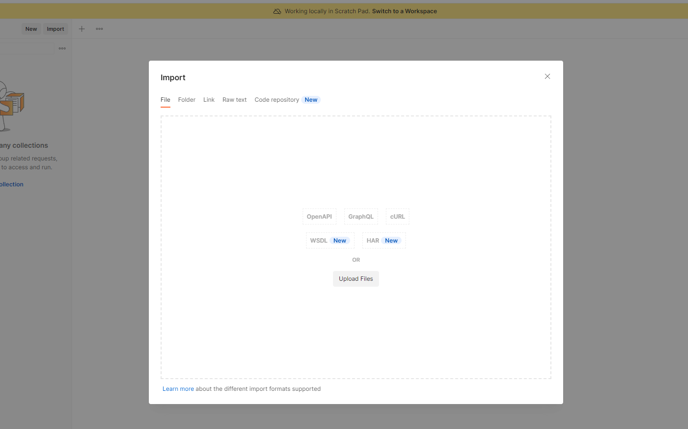
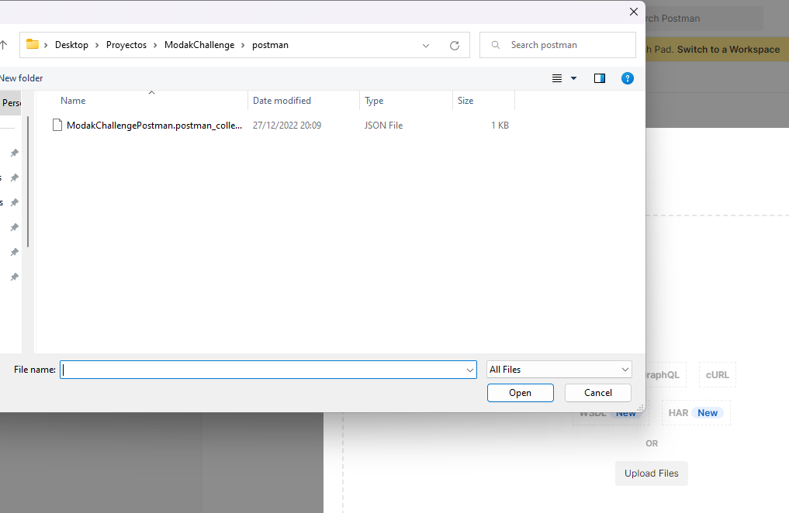
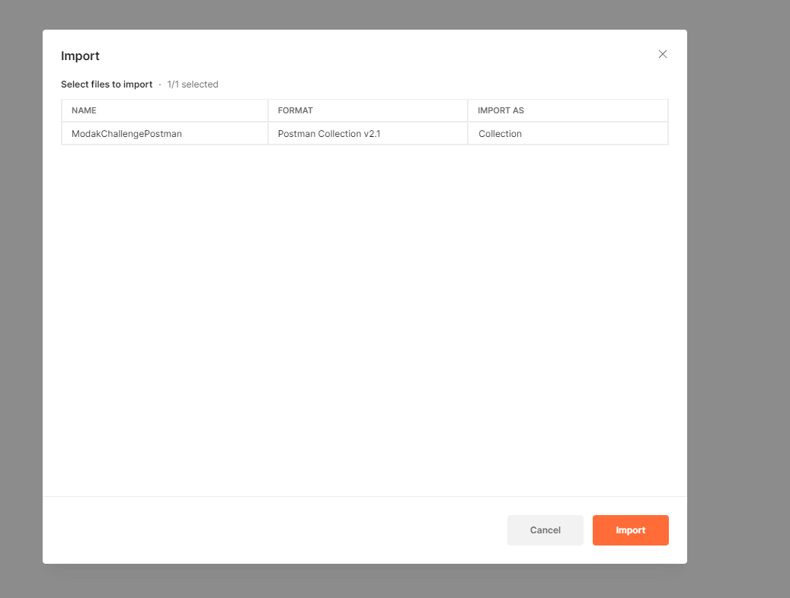
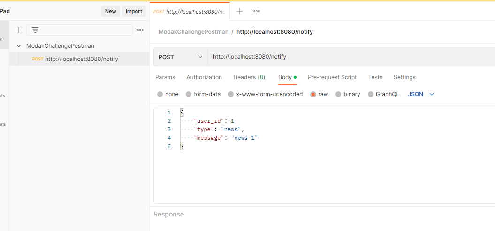

# Modak Challenge

## Rate-Limited Notification Service

### The task

We have a Notification system that sends out email notifications of various types (status update, daily news, project invitations, etc). We need to protect recipients from getting too many emails, either due to system errors or due to abuse, so let’s limit the number of emails sent to them by implementing a rate-limited version of NotificationService.

The system must reject requests that are over the limit.

Some sample notification types and rate limit rules, e.g.:

- **Status:** not more than 2 per minute for each recipient

- **News:** not more than 1 per day for each recipient

- **Marketing:** not more than 3 per hour for each recipient

Etc. these are just samples, the system might have several rate limit rules!

#### NOTES:

- Your solution will be evaluated on code quality, clarity and development best practices.

- Feel free to use the programming language, frameworks, technologies, etc that you feel more comfortable with.

## Solution

### How to run

#### With H2 database
Execute in terminal while in project's root path

```
./gradlew run
```

#### With MySQL database
**_Note:_** In order for this to work a MySQL instance has to be running
1. On MySQL instance run
   ```
   create database modak;
   ```
2. In `resoruces/application.yml` change attributes to 
   * `driverClassName: com.mysql.cj.jdbc.Driver`
   * `url: jdbc:mysql://{{host}}:{{port}}/modak?useSSL=false&allowPublicKeyRetrieval=true` where **{{host}}** and **{{port}}** 
are the host and port where the MySQL instance is running **(usually localhost and 3306)**
   * `password` set it to MySQL root's password
3. Execute in terminal while in project's root path
   ```
   ./gradlew run
   ```

### How to run tests

#### Unit and Integration Tests

Execute in terminal while in project's root path

```
./gradlew test
```

#### Manual Testing

**Considerations:**

All the attributes are non-nullable and are validated.

* `user_id` is of Integer type and has to be greater or equal than 1
* `type` is an enum, cannot be blank and its possible values are:
  * `news`
  * `status`
  * `marketing`
* `message` cannot be blank

###### cURL
```
curl -X POST http://localhost:8080/notify -H "Content-Type: application/json" -d "{\"user_id\": 1,\"type\": \"news\",\"message\": \"news 1\"}"
```

###### Postman
You can download postman from https://www.postman.com/downloads/

Once installed, in the top left corner, in the collections tab, click Import.


Upload Files


Search for the project folder. Once in there, search for the postman directory and import
`ModakChallengePostman.postman_collection.json`.


Once opened, click the orange Import button


And you should be able to see the collection correctly imported and ready to use once the app is running.
